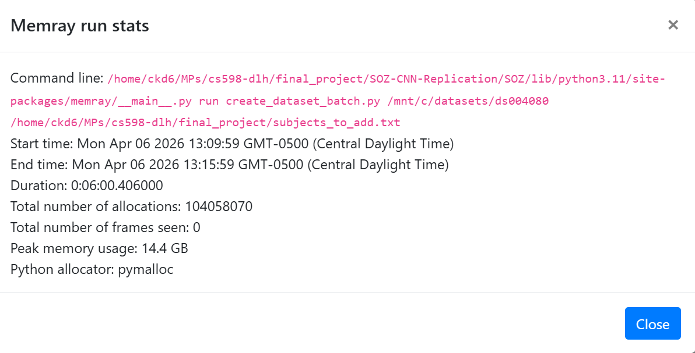
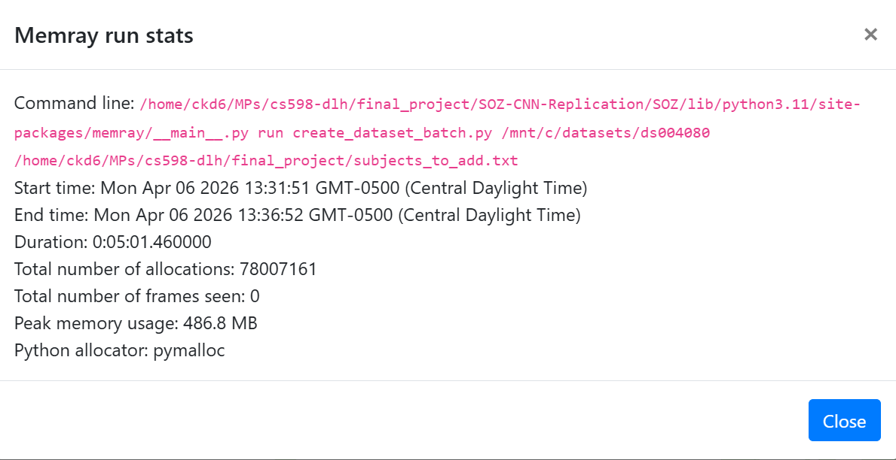

# Memory Performance
Memory performance was benchmarked using [memray](https://github.com/bloomberg/memray). Detailed metrics can be found in the two HTML files. Below are two screenshots comparing the maximum memory used by the streaming approach and the non-streaming approach.

Non-streaming:

Streaming: 

